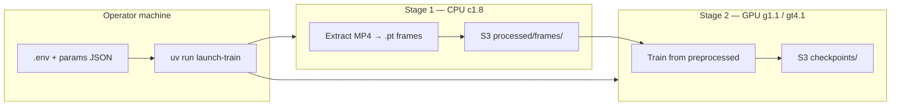

# AGENTS.md — Adaptive ROI Neural Video Codec

Guide for human contributors and AI agents working on this repository. Read this before making changes, especially to training, data loading, or DataSphere Jobs.

## Project summary

**Goal:** Neural video codec for capsule endoscopy with **adaptive bitrate allocation** across clinically significant regions of interest (ROI).

**Training resolution:** Native Kvasir-Capsule **336×336** ([ADR-002](docs/decisions/ADR-002-native-336-training-resolution.md)).

**Execution model:** Heavy GPU training runs on **Yandex DataSphere Jobs** with Object Storage mounted via an S3 connector. Local machines are for manifest generation, unit tests, and CPU smoke runs — not full dataset training.

**Scientific context:** Experiment plan and metrics targets live in [docs/opisanie-eksperimenta.md](docs/opisanie-eksperimenta.md) (Russian). Completed run reports: [docs/experiments/](docs/experiments/).

---

## Quick start

```bash
# Dependencies (operator machine)
uv sync --extra cloud --extra dev
cp .env.example .env   # fill DATASPHERE_PROJECT_ID, S3_CONNECTOR_ID, etc.
yc init

# Tests
uv run pytest

# Local CPU smoke (synthetic batch)
uv run python -m adaptive_roi_codec.train \
  --config configs/base.yaml \
  --params jobs/inputs/train_input.json \
  --dry-run

# Render cloud job config (no submit)
uv run launch-train --dry-run --params jobs/inputs/train_smoke.json

# Submit GPU training job
uv run launch-train --execute --async --params jobs/inputs/train_smoke.json
```

Full cloud setup: [docs/guides/cloud-launch.md](docs/guides/cloud-launch.md).

---

## Repository map

```
adaptive_roi_codec/          Python package
├── model/                   VAECodec, ROIDetector, AdaptiveQuantizer
├── losses/                  ClinicalLoss, SSIM helpers
├── utils/                   config, device, kvasir_loader, env, job_progress, …
├── jobs/                    launch.py (operator CLI), run_train.py (worker entry)
├── cli/                     build-dataset-manifest, extract_frames
└── train.py                 Main training loop (local + cloud)

configs/                     base.yaml — defaults (336×336, hyperparameters)
jobs/
├── configs/                 Job YAML templates (*.yaml.template)
├── inputs/                  Per-run JSON overrides (experiment_id, epochs, …)
└── requirements-datasphere-{gpu,cpu}.txt

docker/datasphere-gpu/       Optional custom GPU image (DataSphere project storage)
docs/
├── decisions/               ADRs (read before changing architecture)
├── guides/                  Cloud launch, S3 connector
└── experiments/             Run reports (EN/RU)

tests/                       pytest suite (no GPU required)
kvasir-capsule/              Local dataset copy (gitignored, ~61 GB)
jobs/configs/.generated/     Rendered job YAML (gitignored)
```

**Entry points**

| Command | Module | Role |
|---------|--------|------|
| `uv run launch-train` | `adaptive_roi_codec.jobs.launch` | Render + submit DataSphere Jobs from `.env` |
| `python -m adaptive_roi_codec.train` | `train.py` | Direct training (local debug) |
| `python -m adaptive_roi_codec.jobs.run_train` | `run_train.py` | DataSphere worker entry (metrics + exit handling) |
| `uv run build-dataset-manifest` | `cli/build_dataset_manifest.py` | MANIFEST.json + train/val/test splits |
| `uv run extract-frames` | `cli/extract_frames.py` | Stage-1 frame extraction (also via `--job extract`) |

---

## Architecture (code)

### Models (`adaptive_roi_codec/model/`)

| Component | File | Role |
|-----------|------|------|
| `VAECodec` | `vae_codec.py` | Encoder/decoder + motion compensator; latent 21×21×192 |
| `ROIDetector` | `roi_detector.py` | MobileNetV3-based ROI map at 336×336 |
| `AdaptiveQuantizer` | `quantizer.py` | Spatially adaptive quantization (κ, q_min/q_max) |

### Loss (`adaptive_roi_codec/losses/clinical_loss.py`)

`ClinicalLoss` combines reconstruction (MSE/SSIM), ROI alignment, rate, and temporal terms. Weights come from `configs/base.yaml` (`alpha`, `lambda_roi`, `lambda_rate`, `lambda_temp`, …).

### Data pipeline (`adaptive_roi_codec/utils/kvasir_loader.py`)

Two data sources (set via `data.source` in params):

| Source | When | Notes |
|--------|------|-------|
| `video` | Legacy / debugging | Decodes MP4 over S3 FUSE — **slow on GPU jobs** |
| `preprocessed` | **Production** | Reads stage-1 `.pt` frames from `processed/frames/` |

**Stage-1 extract** (CPU job): decodes MP4s once → writes preprocessed tensors + manifest to S3.

**Local SSD staging** (V100 runs): `stage_frames_local: true` with `stage_mode: bulk|lazy` copies `.pt` files to extended working storage to avoid S3 FUSE latency. Bulk mode uses `resolve_staging_disk_path()` — must target extended SSD, not root overlay.

### Training loop (`adaptive_roi_codec/train.py`)

- Merges `configs/base.yaml` + JSON params via `merge_dicts`
- Resolves dataset/checkpoint paths from S3 mount or local `kvasir-capsule/`
- Per-video temporal state for motion compensation
- Writes `train_metrics.json` (per-epoch + final) when `TRAIN_METRICS_PATH` is set
- Checkpoints to S3: `/job/s3/<connector>/checkpoints/<experiment_id>/epoch_*.pt`

### Job launcher (`adaptive_roi_codec/jobs/launch.py`)

- Renders `jobs/configs/*.yaml.template` with `.env` + CLI args
- Writes output to `jobs/configs/.generated/` (**never commit**)
- `--job extract` → CPU frame extraction template
- `--batch-size N` → overrides `training.batch_size` in generated params
- Smoke params (`train_smoke.json`) default to sync submit unless `--async`

---

## Configuration layers

Changes propagate through three layers — know which one to edit:

| Layer | Location | Purpose |
|-------|----------|---------|
| **Defaults** | `configs/base.yaml` | Shared hyperparameters, data layout, checkpoint interval |
| **Experiment** | `jobs/inputs/*.json` | `experiment_id`, epochs, batch_size, κ, data.source, workers |
| **Infrastructure** | `.env` (gitignored) | Project ID, S3 connector ID, bucket, working storage size |

**Example experiment override** (`jobs/inputs/train_v100_scale.json`):

```json
{
  "experiment_id": "v100-kappa-2.0-18ep-bs24",
  "training": { "epochs": 18, "batch_size": 36 },
  "quantizer": { "kappa": 2.0 },
  "data": {
    "source": "preprocessed",
    "num_workers": 8,
    "stage_frames_local": true,
    "stage_mode": "bulk"
  }
}
```

**Environment variables on the worker** (set in job templates, not `.env` on worker):

| Variable | Meaning |
|----------|---------|
| `S3_CONNECTOR_ID` | DataSphere S3 connector resource ID |
| `S3_DATA_PREFIX` | Bucket prefix for Kvasir (`kvasir-capsule`) |
| `S3_CHECKPOINT_SUBDIR` | Checkpoint prefix (`checkpoints`) |
| `FRAMES_OUTPUT_DIR` | Preprocessed frames root on S3 mount |
| `TRAIN_REQUIRE_CUDA` | `"1"` → fail fast if no GPU (required on cloud GPU jobs) |
| `TRAIN_BATCH_SIZE` | Optional env override from launcher |
| `DATASPHERE_LOCAL_*` | Paths on extended working storage (SSD) |

S3 mount root on worker: `/job/s3/<S3_CONNECTOR_ID>/`.

---

## Cloud training pipeline

Accepted architecture: [ADR-001](docs/decisions/ADR-001-datasphere-jobs-training.md), [ADR-003](docs/decisions/ADR-003-two-stage-training-pipeline.md).



### Stage 1 — Extract frames (once per dataset revision)

```bash
uv run launch-train --job extract --dry-run
uv run launch-train --job extract --execute
```

Uses `jobs/configs/job_extract_frames.yaml.template` and `jobs/requirements-datasphere-cpu.txt`.

### Stage 2 — GPU training

**Default path:** manual Python env with pinned cu121 wheels (`jobs/configs/job_train_v100.yaml.template`).

```bash
uv run launch-train --execute --async \
  --params jobs/inputs/train_smoke.json \
  --template jobs/configs/job_train_v100.yaml.template
```

**Verify success in job stdout:** `Device: cuda`, batch progress logs, epoch completion — not 13 h of CPU at 0% GPU.

**Instance types**

| Type | GPU | Typical use |
|------|-----|-------------|
| `c1.8` | — | Stage-1 extraction |
| `gt4.1` | T4 16 GB | Smoke / ablations |
| `g1.1` | V100 32 GB | Full training runs |

### Optional: custom Docker image

For faster cold starts (deps baked in, no pip bootstrap on overlay):

- Build in DataSphere project storage: [docker/datasphere-gpu/BUILD.md](docker/datasphere-gpu/BUILD.md)
- Template: [docker/datasphere-gpu/job_train.docker.yaml.template](docker/datasphere-gpu/job_train.docker.yaml.template)
- Platform tests require `jupyter` user (uid 1000) and working pip for that user
- Keep `adaptive_roi_codec` as a job **input** to iterate code without rebuilding the image

---

## Local development

### Dataset (optional, large)

```bash
uv run build-dataset-manifest --dataset-root kvasir-capsule
```

Produces `MANIFEST.json` and `splits/{train,val,test}_videos.txt`. Dataset directory is gitignored.

### Lint / format

```bash
uv run ruff check adaptive_roi_codec tests
```

Ruff config: line length 100, Python 3.10+ (`pyproject.toml`).

### What not to do locally

- Do not expect full 50-epoch GPU training locally (by design — see ADR-001).
- Do not commit `.env`, checkpoints, `*.pt`, or `jobs/configs/.generated/`.
- Do not use `python: auto` for GPU jobs — it may install CUDA 13 wheels incompatible with V100 hosts (ADR-003).

---

## Testing

```bash
uv run pytest                    # full suite
uv run pytest tests/test_kvasir_loader.py -k bulk   # targeted
```

| Area | Test files |
|------|------------|
| Config merge | `test_config.py` |
| Device / CUDA guard | `test_device.py` |
| Kvasir loader / staging | `test_kvasir_loader.py`, `test_preprocessed_loader.py` |
| Job launcher | `test_launch.py` |
| Metrics JSON shape | `test_train_metrics.py` |
| DataSphere exit / progress | `test_datasphere_exit.py`, `test_job_progress.py` |
| GPU requirements pin | `test_datasphere_requirements.py` |
| Models | `test_vae_codec.py`, `test_quantizer.py` |

**Before pushing** changes to training, loaders, or job templates: run `uv run pytest`.

Add regression tests when fixing bugs (see project debugging skill). Prefer tests that fail without the fix and pass with it.

---

## Git and collaboration

### Commit messages

[Conventional Commits](CONTRIBUTING.md): `feat:`, `fix:`, `docs:`, `test:`, `perf:`, `refactor:`, `chore:`.

Optional scope: `fix(docker):`, `feat(train):`. One logical change per commit. PR titles match commit style.

### Generated / secret files (never commit)

- `.env`, credentials, access keys
- `jobs/configs/.generated/`
- `checkpoints/`, `metrics/`, `*.pt`, `kvasir-capsule/`
- Local logs (`job_progress.jsonl`, `logs_debug/` if present)

### ADRs

Significant architectural changes need a new ADR in `docs/decisions/` — do not silently reverse accepted decisions. Update [docs/decisions/README.md](docs/decisions/README.md) index.

---

## Common failures (troubleshooting)

| Symptom | Likely cause | Fix |
|---------|--------------|-----|
| `Device: cpu` on GPU VM | PyTorch CUDA mismatch | Use `jobs/requirements-datasphere-gpu.txt` + `TRAIN_REQUIRE_CUDA=1` |
| 13+ h epoch, 0% GPU | CPU training + S3 MP4 decode | Run stage-1 extract; set `data.source: preprocessed` |
| `Video directory not found` | Wrong S3 layout | Upload under `kvasir-capsule/raw/labelled_videos/` |
| Bulk staging skipped / disk full | Staging path on root overlay | Use `resolve_staging_disk_path()` / extended SSD vars in job template |
| Job ERROR despite training OK | Worker exit code / multiprocessing | Check `run_train.py` + `datasphere_exit.py`; ensure clean CUDA teardown |
| Docker test #6 pip failed | Root-only venv | System pip + writable `/home/jupyter` (see `docker/datasphere-gpu/Dockerfile`) |
| `SignatureDoesNotMatch` on upload | Wrong AWS region | `AWS_DEFAULT_REGION=ru-central1`; prefer `yc storage s3 cp` |

Extended troubleshooting: [docs/guides/cloud-launch.md](docs/guides/cloud-launch.md#troubleshooting).

---

## Documentation index

| Document | Contents |
|----------|----------|
| [README.md](README.md) | Human-oriented overview |
| [README.ru.md](README.ru.md) | Russian README |
| [docs/opisanie-eksperimenta.md](docs/opisanie-eksperimenta.md) | Experiment specification (paper) |
| [docs/guides/cloud-launch.md](docs/guides/cloud-launch.md) | End-to-end cloud setup |
| [docs/guides/datasphere-s3-connector.md](docs/guides/datasphere-s3-connector.md) | S3 connector + secrets |
| [docs/decisions/](docs/decisions/) | ADRs |
| [docker/datasphere-gpu/BUILD.md](docker/datasphere-gpu/BUILD.md) | Custom GPU image build |

---

## Guidelines for AI agents

### Do

- Read relevant ADRs before changing training infrastructure or resolution.
- Keep diffs minimal and focused; match existing naming and patterns in neighboring code.
- Run `uv run pytest` after logic changes to loaders, training, or jobs.
- Use `.env.example` as the template for new env vars (document + example value).
- Prefer JSON params + YAML defaults over hardcoding experiment values in Python.
- Preserve DataSphere job contract: single-line `cmd`, declared `outputs`, `s3-mounts`, `TRAIN_REQUIRE_CUDA` on GPU jobs.

### Do not

- Commit secrets, generated job configs, checkpoints, or the dataset.
- Switch GPU jobs back to `env.python: auto` without an ADR.
- Train from `data.source: video` on production GPU runs without explicit reason.
- Add broad refactors mixed with bug fixes in one commit.
- Create markdown docs the user did not ask for (except this file and ADRs when architecturally required).

### Suggested workflow for agents

1. **Reproduce** — run the failing test or smoke command; capture logs.
2. **Localize** — identify layer (loader / train / job template / infra).
3. **Fix root cause** — not symptoms (e.g. fix S3 path, not silence errors).
4. **Guard** — add or extend a pytest case when fixing a regression.
5. **Verify** — `uv run pytest`; for cloud changes, `--dry-run` the job YAML.

### Hyperparameter changes for cloud runs

Edit `jobs/inputs/<experiment>.json`, then:

```bash
uv run launch-train --execute --async \
  --params jobs/inputs/<experiment>.json \
  --template jobs/configs/job_train_v100.yaml.template
```

Checkpoints and metrics land under `checkpoints/<experiment_id>/` and job outputs (`train_metrics.json`) on S3 / DataSphere UI.

---

## External references

- [DataSphere Jobs](https://yandex.cloud/en/docs/datasphere/concepts/jobs/)
- [DataSphere user Docker images](https://yandex.cloud/en/docs/datasphere/operations/user-images)
- [Yandex Object Storage S3 API](https://yandex.cloud/en/docs/storage/tools/aws-cli)
- [uv package manager](https://docs.astral.sh/uv/)
